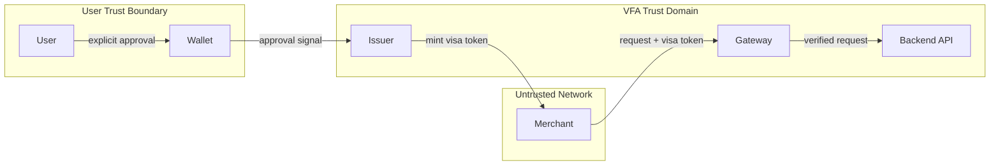

# Security Model

VFA assumes that certain digital interactions must require
cryptographic proof of explicit user consent before execution.

In VFA v0.1, the **issuer** is the sole authority that signs and mints
visa tokens. The wallet collects user approval; it does not sign tokens directly.

---

## Core artifact

**Visa Token**

A short-lived cryptographically signed artifact issued by the VFA issuer
that binds:

- user identity
- declared intent
- merchant identity
- endpoint
- expiration

The gateway MUST verify the visa token before any protected request
is dispatched to the backend.

---

## Primary security objectives

- link every request to explicit, verifiable user approval
- prevent token tampering and forgery
- limit the usable lifetime of authorization artifacts
- enforce policy at the gateway before backend access
- bind tokens to a specific merchant, endpoint, and user

---

## Trust boundaries

| Boundary | Trust level | Key assumption |
|----------|-------------|----------------|
| **Wallet** | Trusted by user | Presents approval request faithfully; not trusted by the gateway |
| **Merchant** | Untrusted intermediary | Treated as potentially hostile; may not modify signed payloads |
| **Issuer** | Trusted by gateway | Protects signing key; mints tokens only on confirmed approval |
| **Gateway** | Trusted by backend | Enforces verification before every dispatch; no bypass permitted |
| **Backend** | Trusts gateway only | Rejects all requests not originating from the gateway (mTLS) |
| **User** | Root trust anchor | Provides explicit approval for the requested interaction |

---

## Assumptions

**Issuer**
- holds the signing key securely (HSM or equivalent in production)
- mints a visa token only after confirmed wallet approval
- includes all security-relevant fields in the signed payload

**Wallet**
- presents the handshake request to the user without modification
- does not sign tokens in v0.1; its role is approval collection only

**Merchant**
- is treated as a potentially hostile intermediary
- may attempt to modify request parameters, but any change to fields
covered by the issuer signature will invalidate the token
- the gateway rejects any token field not covered by the issuer signature

**Gateway**
- verifies every inbound token before dispatch — no caching of prior results
- verifies that the actual HTTP request matches the signed intent fields
- enforces deny-by-default routing
- maintains a nonce deduplication store

**Backend**
- accepts requests exclusively from the gateway (enforced via mTLS service identity)
- executes only against the verified, committed intent

---

## Token lifetime

Replay protection relies on both:

- short token lifetime
- nonce deduplication at the gateway

| Parameter | Value | Notes |
|-----------|-------|-------|
| `ttlMs` (handshake approval window) | ≤ 300 000 ms | How long the wallet displays the request |
| `exp − iat` (token validity) | **≤ 60 s** | Enforced server-side by the gateway |

These two values are distinct. A long approval window does not imply a long token lifetime.

---

## Production expectations

**Required:**
- asymmetric signing (Ed25519 or ECDSA P-256); HMAC disallowed
- hardware-backed key storage for the issuer signing key
- key rotation (≤ 1 year validity)
- tokens MUST include a `kid` (key identifier) for rotation support
- nonce deduplication store at the gateway
- audience and endpoint binding (`aud`, `merchantId`, `endpoint`)
- token lifetime enforcement (`exp − iat ≤ 60 s`)
- mTLS on all service-to-service channels
- append-only audit log

**Recommended:**
- real-time revocation propagation (≤ 30 s)
- rate limiting on approval requests
- key separation across environments (dev / staging / prod)

---

## Demo / lab note

A shared-secret HMAC scheme may be used in a demonstration or laboratory
environment as a temporary measure. It must not be used in production.
Algorithm negotiation and `alg: none` are disallowed in all environments.

---

## VFA Trust Boundary Diagram

